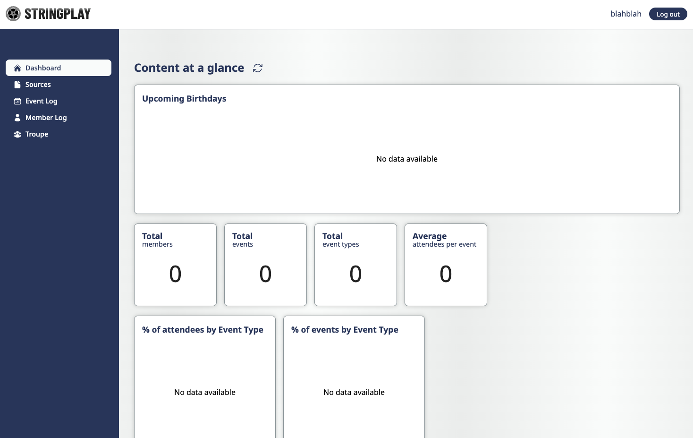
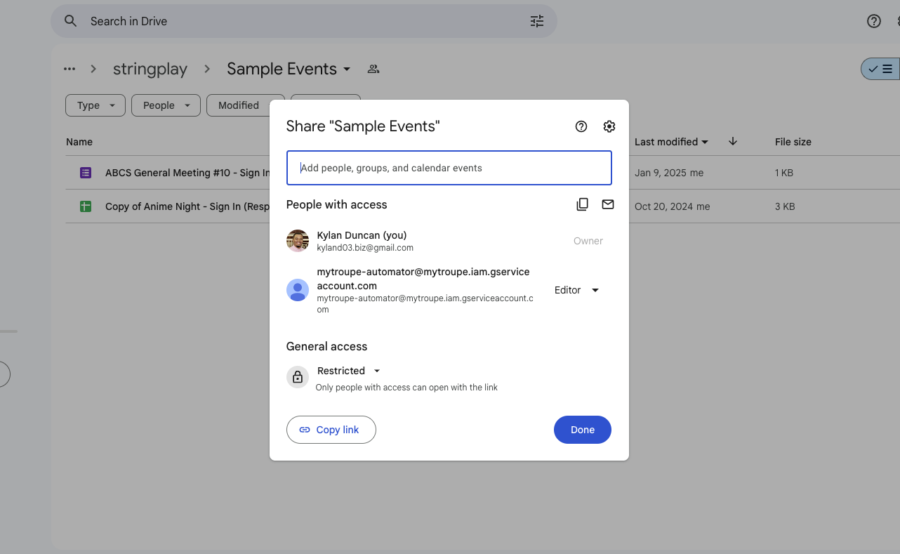
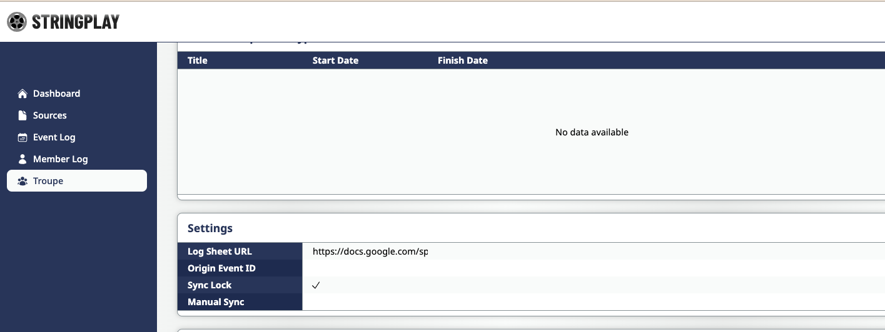

# Getting Started

Follow this guide to begin collecting information from your Google Drive.

**Prerequisites**

- An unique email
- A Google Sheets / Google Forms file, or a Google Drive folder

## Register an account

In order to gain access to the console, you'll need to register a new account with the service. When creating an account, make sure to:

- Use a unique username between 8-20 characters
- Have a strong password with a minimum of 8 characters
- Use a unique email
- Enter your invite code if you've been given one

Otherwise, you may run into issues with account creation. Once you've seen the sign up confirmation notification, you can use your new
credentials to log in to the console. **Do not lose your credentials.** If you do, please contact the developer to discuss account
recovery options.

## Add your data

When logging in, the first screen that you will see is the Dashboard. This will contain a summary of your data, which should be currently
empty. Let's change that by adding some data.

Click on the Sources tab. This screen allows you to quickly add files and folders with data to collect. To add a file, go to your file's 
location in Google Drive. You will either need to make the file public or share the file with **mytroupe-automator@mytroupe.iam.gserviceaccount.com**.

- To edit access for Google Forms, click on More > Add collaborators
- To edit access for Google Sheets, click on Share
- To edit access for Google Drive, click on the folder name, then click Share

Once you've added access, click on Copy Link.

Go back to the Sources tab in stringplay and Add the link to Source Files table for Google Sheets or Google Forms, by clicking "New", adding a new row, 
and pasting the link in the Source File URI column. You can set the Start Date column to any date you want, try to pick one that makes sense (e.g. if 
the file you're adding is the sign in sheet for an event, pick the date of the event). For a Google Drive folder, follow the same steps for the Source 
Folders table.

Once you've successfully added your file, the app will collect data for you once a day, daily.

## Initiate a sync

Instead of waiting for the app to collect information for you, you can signal the app to collect your information now by performing a **manual sync**.

Navigate to the Troupe tab, and scroll down to the Settings table. Here, you should see a lightning icon next to the Manual Sync header. 

::: warning
If you see no icon next to the Manual Sync header and you see a checkmark next to the Sync Lock header, this means that a sync is already occurring. Wait for the sync to end for your data to be updated.

During a sync, you are unable to perform modifying actions to your troupe. Your data should be updated between a couple of seconds or minutes, however, if the sync lock stays on beyond 10 minutes, notify the developer. 
:::

Click on the lightning icon to initiate a manual sync. Now a checkmark should be next to the Sync Lock header. Wait for the app to collect information from your Google Drive. You may need to refresh occassionally.

Once the lightning icon is back next to the Manual Sync header, you should see the results. Go to the Member Log tab to see the data that's been collected for you.